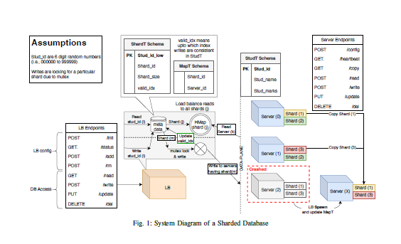
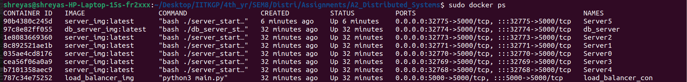
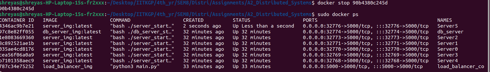
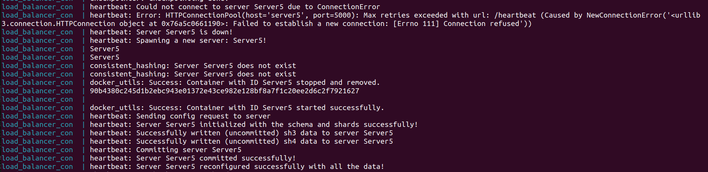

<font size=3>

# Assignment-2 Distributed Systems
This repository contains the code for the Assignment-2 of Distributed Systems(CS60002) course of Spring, 2024.

# Implementing a Scalable Database with Sharding
<p align="center">
      <br><strong>Fig.1: Overview</strong>
</p>

# Table of Contents

- [Assignment-2 Distributed Systems](#assignment-2-distributed-systems)
- [Implementing a Scalable Database with Sharding](#implementing-a-scalable-database-with-sharding)
- [Table of Contents](#table-of-contents)
- [Group Details](#group-details)
- [Prerequisite](#prerequisite)
  - [1. Docker: latest](#1-docker-latest)
  - [2. Docker-compose standalone](#2-docker-compose-standalone)
- [Getting Started](#getting-started)
  - [Building Docker Images](#building-docker-images)
  - [Running Docker Containers](#running-docker-containers)
  - [Interact with System](#interact-with-system)
  - [Remove Existing Container](#remove-existing-container)
  - [Clear Existing Images](#clear-existing-images)
- [Design Choices](#design-choices)
- [Troubleshooting](#troubleshooting)
  - [Docker Exit with Code 137](#docker-exit-with-code-137)
  - [Removing Docker Containers](#removing-docker-containers)
    - [1. Stop docker container](#1-stop-docker-container)
    - [2. Remove docker container](#2-remove-docker-container)
- [Evaluation](#evaluation)
  - [Pre-Analysis Setup](#pre-analysis-setup)
  - [Part-1: Read and Write Speed Analysis](#part-1-read-and-write-speed-analysis)
  - [Part-2: Scaling number of shard replicas to 6](#part-2-scaling-number-of-shard-replicas-to-6)
  - [Part-3 : Scaling number of servers to 10 and number of replicas to 8](#part-3--scaling-number-of-servers-to-10-and-number-of-replicas-to-8)
  - [Part-4: Endpoint Checking and Server Drop Analysis](#part-4-endpoint-checking-and-server-drop-analysis)
    - [Endpoint Checking](#endpoint-checking)
    - [Server Drop Analysis](#server-drop-analysis)
      - [Initial Server configuration](#initial-server-configuration)
      - [Server configuration after stopping container](#server-configuration-after-stopping-container)
      - [Load-balancer side logs](#load-balancer-side-logs)


# Group Details
Repo Link: https://github.com/PranavMehrotra/A2_Distributed_Systems 
1. Pranav Mehrotra (20CS10085)
2. Saransh Sharma (20CS30065)
3. Pranav Nyati (20CS30037)
4. Shreyas Jena (20CS30049)


# Prerequisite

## 1. Docker: latest

    sudo apt-get update

    sudo apt-get install \
        ca-certificates \
        curl \
        gnupg \
        lsb-release

    sudo mkdir -p /etc/apt/keyrings
    curl -fsSL https://download.docker.com/linux/ubuntu/gpg | sudo gpg --dearmor -o /etc/apt/keyrings/docker.gpg

    echo \
    "deb [arch=$(dpkg --print-architecture) signed-by=/etc/apt/keyrings/docker.gpg] https://download.docker.com/linux/ubuntu \
    $(lsb_release -cs) stable" | sudo tee /etc/apt/sources.list.d/docker.list > /dev/null

    sudo apt-get update

    sudo apt-get install docker-ce docker-ce-cli containerd.io

## 2. Docker-compose standalone 
    sudo curl -SL https://github.com/docker/compose/releases/download/v2.15.1/docker-compose-linux-x86_64 -o /usr/local/bin/docker-compose
    
    sudo chmod +x /usr/local/bin/docker-compose
    
    sudo ln -s /usr/local/bin/docker-compose /usr/bin/docker-compose


# Getting Started


## Building Docker Images
To create the necessary Docker images for the load balancer and servers, execute the following command:

```bash
make install
```

## Running Docker Containers
To initiate the deployment of load balancer containers, execute the following command:

```bash
make deploy
```
This command will launch the load balancer container, which, in turn, will spawn the initial N server Docker containers along with their heartbeat probing threads. Ensure that the necessary configurations are in place for a seamless deployment. The command also clears any existing containers using server or load balancer image (i.e. execute make clean).

<span style="color:red">**Note:** The deployment command launches Docker in the background mode. Therefore, users are advised to check the docker-compose logs to view load-balancer logs.</span>

## Interact with System
To interact with the load balancer and send GET/POST requests, launch the interactive terminal using the following command:

```bash
bash client.sh
```
## Remove Existing Container
To stop and remove all containers using the server image and load balancer, run the following command:

```bash
make clean
```

Executing this command is recommended before running the main code to ensure there are no conflicting container instances already running. This helps prevent potential errors and ensures a clean environment for the code execution.

## Clear Existing Images
To remove previously created server and load balancer images, execute the following command:

```bash
make deepclean
```

It is advisable to run this command before executing the main code to eliminate any pre-existing images with the same name. This ensures a clean slate and avoids potential conflicts during the code execution.

# Design Choices
<ol>
<li> Every server container maintains both a SQL database to store the shard data and a server application to handle config/read/write/delete operations. So, the server container is a combination of a SQL database and a server application. It handles the requests/queries from the load balancer and updates the data in the SQL database accordingly, as well as sends the response back to the load balancer. </li>
<li> When executing the /add endpoint, users may provide existing server hostnames as part of the request. In such cases, the load balancer takes a proactive approach to ensure that the specified num_add parameter is honored. Even if the user supplies hostnames that already exist in the system, the load balancer will ignore already existing hostnames and generate new hostnames for additional servers to fulfill the exact count specified by num_add.
<li> When executing the /rm endpoint, users may provide hostnames for removal. To ensure the specified number of servers to be removed is consistently achieved, the load balancer employs a strategy wherein, if the user-provided hostname doesn't exist in the system, it randomly selects and removes a server hostname from the existing set.
<li> Every server is equipped with a heartbeat thread that sends a heartbeat message every 0.2 seconds. If no heartbeat is detected for two consecutive attempts, the server is declared dead, triggering the spawning of a new server. This mechanism prevents premature declarations of server death due to network fluctuations, ensuring stability in the system.</li>
<li> The load balancer maintains two dictionaries: one ShardT Schema (which maps the lowest data entry index to its corresponding shard id) and one MapT schema (which maps the shard id to the list of server ids that contain replicas of that shard). Whenever there is a change in the server configuration (init/add/removal), or an update (write/delete) in a shard data, the load balancer updates these dictionaries to reflect the new changes accurately.</li>
<li> Metadata SQL server: In addition to the dictionaries maintained in the load balancer, we also deploy a metadata server that also stores the ShardT and MapT schemas in a SQL database. This server is used to have a backup of the metadata in case of a load balancer failure (Note that it does not store the actual shard data, but only these two mappings). 
We employ a Checkpointing mechanism that periodically updates the ShardT and MapT schemas in the metadata server by querying these mappings from the load balancer (every 30 seconds). This ensures that the metadata server is up-to-date with the latest mappings, even if the load balancer fails. </li> We used a periodic checkpoint mechanism rather than an immediate update to avoid frequent updates to the metadata server, which could lead to performance degradation, as then the metadata server would need to be updated for every write/delete operation/service configuration change. </li>
<li> Recovery mechanism for servers: We implement a recovery mechanism for servers using the heartbeat thread. If a server crashes, the heartbeat thread detects it, respawns a new server container, and reconfigures it with the correct database schema. Next, the heartbeat thread copies the data for the shards (which were maintained by the crashed server) from the the shard replicas in the other servers and repopulates the new server. This ensures that the new server is up-to-date with the latest data and is ready to serve requests. </li>
</ol>

# Troubleshooting

## Docker Exit with Code 137
Code 137 indicated RAM memory related issue. Stop and remove already runining container to free up space.

## Removing Docker Containers

### 1. Stop docker container
```
Particular container: docker stop container_id
Stop all running container: docker stop $(docker ps -a -q)
```

### 2. Remove docker container
```
Particular container: docker rm container_id
Remove all running container: docker rm $(docker ps -a -q)
```


# Evaluation

## Pre-Analysis Setup

```
  # initialise and deploy containers
   make install
   make deploy
```
## Part-1: Read and Write Speed Analysis

```
  # initialise database container with default configuration
   cd db_analysis/
   python p1.py --type init
   python p1.py --type status       # check status

  # run analysis file
   python p1.py --type write --nreqs 10000        # should take 5-6 mins
   python p1.py --type read --nreqs 10000

```
  Leveraging the default configuration, i.e.,

  ```
  NUM_SERVERS: 6
  NUM_SHARDS: 4
  NUM_REPLICAS: 3
  ```
  We obtain the following statistics for 10000 write and read requests respectively:

  ```
    - Request Type: write

        No of successful requests: 10000/10000
        No of failed requests: 0/10000
        Time taken to send 10000 requests: 188.25956535339355 seconds

    - Request Type: read

        No of successful requests: 10000/10000
        No of failed requests: 0/10000
        Time taken to send 10000 requests: 60.557310581207275 seconds
  ```


## Part-2: Scaling number of shard replicas to 6


```
  # initialise database container with specific configuration
   cd db_analysis/
   python p2.py --type init         # initialise database
   python p2.py --type status       # check status

  # run analysis file
   python p2.py --type write --nreqs 10000        # should take 5-6 mins
   python p2.py --type read --nreqs 10000

```

On setting `NUM_REPLICAS=6`, keeping the number of servers and shards fixed, i.e.,

  ```
  NUM_SERVERS: 6
  NUM_SHARDS: 4
  NUM_REPLICAS: 6
  ```

  We obtain the following statistics for 10000 write and read requests respectively:

  ```
- Request Type: write

        No of successful requests: 10000/10000
        No of failed requests: 0/10000
        Time taken to send 10000 requests: 571.5665924549103 seconds

- Request Type: read

        No of successful requests: 9995/10000
        No of failed requests: 5/10000
        Time taken to send 10000 requests: 109.68647050857544 seconds
  ```

The increased latency for write and read requests can be attributed to the increased number of replicas for each shard. This implies that both write and read requests need to access all replicas of a shard to maintain consistency, increasing the time taken to handle requests.

## Part-3 : Scaling number of servers to 10 and number of replicas to 8


```
  # initialise database container with specific configuration
   cd db_analysis/
   python p3.py --type init         # initialise database
   python p3.py --type status       # check status

  # run analysis file
   python p3.py --type write --nreqs 10000        # should take 7-8 mins
   python p3.py --type read --nreqs 10000

```

The following configuration for the database server, i.e.,

  ```
  NUM_SERVERS: 10
  NUM_SHARDS: 6
  NUM_REPLICAS: 8
  ```

  yields the following statistics for 10000 write and read requests respectively:

  ```
- Request Type: write

    No of successful requests: 10000/10000
    No of failed requests: 0/10000
    Time taken to send 10000 requests: 758.3099572658539 seconds

- Request Type: read

    No of successful requests: 9999/10000
    No of failed requests: 1/10000
    Time taken to send 10000 requests: 110.17270064353943 seconds
    
  ```

In this case, there is a noticeable, albeit slight increase in the latency for write and read requests compared to `Part-2`. 

Why isn't the increase in latency for read requests as prominent as `Part-2`? It has to do with the fact that an increase in the number of servers leads to better distribution of read requests, implying that incoming requests face lesser contention while accessing shard replicas across a large number of servers. This leads to only a slight increase in the latency for handling read requests, as shown above. 

For write requests, an increase in the number of replicas to be edited overcomes the benefit of less contention due to more servers, leading to a marked increase in latency for processing write requests.

## Part-4: Endpoint Checking and Server Drop Analysis

### Endpoint Checking

```
# initialise database container with specific configuration
   cd db_analysis/
   python p4.py --type init         # initialise database
   python p4.py --type status       # check status

  # write/read requests
   python p4.py --type write --nreqs 100        
   python p4.py --type read --nreqs 100

  # update/delete requests
   python p4.py --type update       # updates a random db entry
   python p4.py --type delete       # deletes a random entry from all involved replicas

  # add/remove servers
   python p4.py --type add        # adds list of servers mentioned in script
   python p4.py --type rm         # removes list of servers mentioned in script
```

### Server Drop Analysis

#### Initial Server configuration

The initial server configuration consists of 6 servers (`Server0` to `Server5`), as shown in Fig.2.

<p align="center">
      <br><strong>Fig.2: Initial Configuration</strong>
</p>

#### Server configuration after stopping container

```
  # list all active server containers
    docker ps       

  # select a random <container_id> and stop the container
    docker stop <container_id>

  # re-check the server configuration to see if the stopped container has respawned or noticeable
    docker ps
```

<p align="center">
      <br><strong>Fig.3: Configuration just after stopping `Server5`</strong>
</p>

When `Server5` is stopped via `docker stop <container_id`, it is quickly respawned, as shown in Fig.3.

#### Load-balancer side logs

The server-shard mapping of the current configuration is as follows:


```
  'Server0': ['sh1', 'sh2']
  'Server1': ['sh1', 'sh3']
  'Server2': ['sh1', 'sh4']
  'Server3': ['sh2', 'sh3']
  'Server4': ['sh2', 'sh4']
  'Server5': ['sh3', 'sh4']
```

<p align="center">
      <br><strong>Fig.4: Load-balancer logs showing the respawning of `Server5`</strong>
</p>


As shown in Fig.5, after the heartbeat thread detects that `Server5` is down, it quickly respawns a new copy and copies the `sh3` and `sh4` contents from replicas in other servers to the same.


</font>
